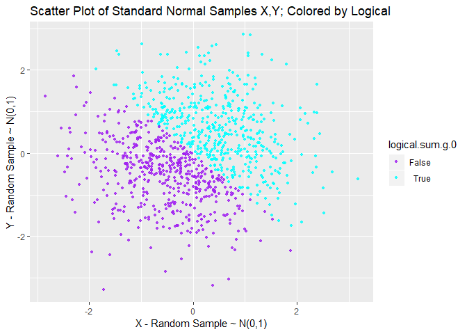
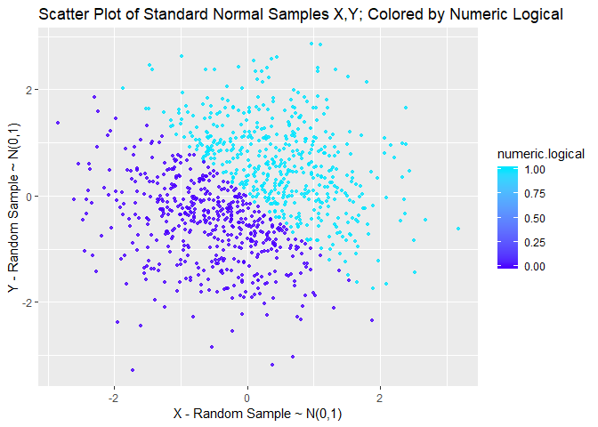
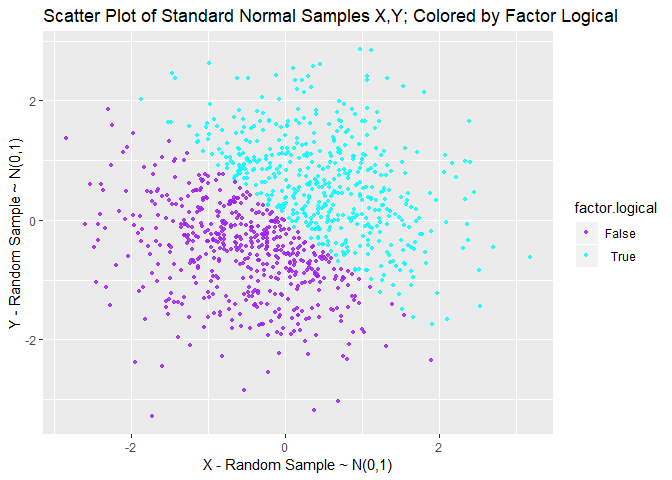

P8105 Homework 1
================
Quinton Neville
Due September 21, 2018

Problem 1
=========

First, we will create a data frame `variable.types.df`, containing a random sample from a random variable *X* ∼ *U**n**i**f**o**r**m*(0, 5), a logical variable describing whether those elements are greater than two, a character variable from a random word sample from the sentence "The quick brown fox jumps over the lazy dog", and a randomly selected factor variable sampled from five levels.

``` r
#Defining number of rows/observations for our variable types data frame
n.row.types.df <- 10

#Set the seed for reproducibility in random sample
set.seed(24)

#Generate a character sample using strsplit on a generic sample, need unlist to coerce to vector
char.sentence <- "The quick brown fox jumped over the lazy dog"  
char.word.sample <- unlist(strsplit(char.sentence, "[ ]"))

#Creating our data frame with rUnif(0,5), logical, character random sample, and factor vars
variable.types.df <- tibble(
  unif.sample = runif(n.row.types.df, min = 0, max = 5),                  #Random sample 10 rUnif(0,5)
  logical.unif.g.2 = ifelse(unif.sample > 2, TRUE, FALSE),                #Logical, TRUE if rUnif > 2
  char.sample = sample(char.word.sample, n.row.types.df, replace = TRUE), #Random char sample
  factor.sample = as.factor(sample(1:5, n.row.types.df, replace = TRUE))  #Random factor sample, 5 levels
)

#Check the schematics of the data frame for accuracy
str(variable.types.df)
```

    ## Classes 'tbl_df', 'tbl' and 'data.frame':    10 obs. of  4 variables:
    ##  $ unif.sample     : num  1.46 1.12 3.52 2.59 3.31 ...
    ##  $ logical.unif.g.2: logi  FALSE FALSE TRUE TRUE TRUE TRUE ...
    ##  $ char.sample     : chr  "over" "fox" "the" "the" ...
    ##  $ factor.sample   : Factor w/ 4 levels "1","2","3","4": 1 3 4 1 2 4 1 3 4 1

``` r
#Visualize the first five observations
head(variable.types.df, 5)
```

    ## # A tibble: 5 x 4
    ##   unif.sample logical.unif.g.2 char.sample factor.sample
    ##         <dbl> <lgl>            <chr>       <fct>        
    ## 1        1.46 FALSE            over        1            
    ## 2        1.12 FALSE            fox         3            
    ## 3        3.52 TRUE             the         4            
    ## 4        2.59 TRUE             the         1            
    ## 5        3.31 TRUE             brown       2

Now, we will attempt to take the mean of each variable in `variable.types.df`.

``` r
#Here we use the apply function to apply the mean function to each column var
mean.variable.types <- apply(variable.types.df, 2, mean)

#Apply gives all NA's because last 2 cols are non-numeric, so will compute individually and store as vector
mean.variable.types <- with(variable.types.df, c(mean(unif.sample),
                                               mean(logical.unif.g.2),
                                               mean(char.sample),
                                               mean(factor.sample)))

#Give the vector elements the appropriate names, view the output
names(mean.variable.types) <- colnames(variable.types.df)
mean.variable.types
```

    ##      unif.sample logical.unif.g.2      char.sample    factor.sample 
    ##          2.71178          0.60000               NA               NA

We see that the `mean()` function works for the Uniform sample variable because it is of numeric data type, and surprisingly also works for the logical variable describing whether each value in the sample is greater than two. This occurs because when `mean()` encounters a logical data type, it must automatically convert the logical using `as.numeric()` to 1's and 0's, thus giving us the numeric proportion of `TRUE` for the logical variable. As for the character and factor variables, the `mean()` function does not work because these data types are non-numeric, and returns `NA` instead.

Now we will convert the logical, character, and factor variables in `variable.types.df`to numeric data types.

``` r
#Using the mutate function in dplyr, we will create a new df with coerced numerics
coerced.numeric.df <- variable.types.df %>%
  mutate(numeric.logical.g.2 = logical.unif.g.2 %>% as.numeric,
         numeric.char.sample = char.sample %>% as.numeric,
         numeric.factor.sample = factor.sample %>% as.numeric)

#Check out the new variables
head(coerced.numeric.df[,5:7])
```

When we attempt to coerce the logical, character, and factor variable data types, respectively, we see that the logical is transformed from `TRUE` and `FALSE` to 1's and 0's, the character cannot be coerced to numeric and produces `NA`'s, while the factor variable is converted to a numeric describing in which level the factor element resides. However, it is important to note that if a character variable took the form `c("1", "2", etc.)`, it would be coerced to the corresponding integer by `as.numeric()`.

Lastly, we will coerce the original character variable to factor to numeric and the original factor variable to character to numeric.

``` r
#Creating a new data frame with variables for the aforementioned data type coercions
coerced.factor.char.df <- variable.types.df %>%
  mutate(char.coerced.factor.numeric = char.sample %>% as.factor %>% as.numeric,
         factor.coerced.char.numeric = factor.sample %>% as.character %>% as.numeric)

#Check out the new variables
head(coerced.factor.char.df[,5:6])
```

Again, we see that coercing the character variable to a factor and then numeric, transforms the character variable to a factor with 8 levels, then to a numeric describing the corresponding levels in which the factor element resides. On the other hand, because our original factor variable was "numeric", in the sense that it was sampled from 5 levels, described 1-5, when we coerce this variable to a character, it looks like `c("1", "3", etc.)`. So when we then coerce it to numeric, it assumes the integer values described by the characters. If, however, the factor levels had been categories described by characters rather than numerics, the end result would have been `NA`'s, as "true" character variables cannot be coerced to numeric, as we saw earlier.

Problem 2
=========

First, we will create a data frame `standard.normal.df` with variables describing two seperate random samples of size 1000 from *Z* ∼ *N*(0, 1), a logical variable describing whether the sum of the two observations generated from *Z* is greater than zero, and a numeric and factor variable coerced from the aforementioned logical.

``` r
#Definine number of observations/nrows for the data frame
n.row.stdnorm.df <- 1000

#Set the seed for reproducibility of random samples
set.seed(4)

#Creating our data frame with two std norm samples, logical for sum > 0, coerced numeric and factor
standard.normal.df <- tibble(
  x = rnorm(n.row.stdnorm.df, 0, 1),                   #sample x from Z ~ N(0,1) length 1000
  y = rnorm(n.row.stdnorm.df, 0, 1),                   #sample y from Z ~ N(0,1) length 1000
  logical.sum.g.0 = ifelse((x + y) > 0, TRUE, FALSE),  #logical, TRUE if x + y > 0
  numeric.logical = logical.sum.g.0 %>% as.numeric,    #cast logical as numeric
  factor.logical = logical.sum.g.0 %>% as.factor       #cast logical as factor
)

#Check out the schematic of the df for accuracy
str(standard.normal.df)
```

    ## Classes 'tbl_df', 'tbl' and 'data.frame':    1000 obs. of  5 variables:
    ##  $ x              : num  0.217 -0.542 0.891 0.596 1.636 ...
    ##  $ y              : num  0.177 1.689 -1.347 1.076 -0.456 ...
    ##  $ logical.sum.g.0: logi  TRUE TRUE FALSE TRUE TRUE TRUE ...
    ##  $ numeric.logical: num  1 1 0 1 1 1 0 1 1 1 ...
    ##  $ factor.logical : Factor w/ 2 levels "FALSE","TRUE": 2 2 1 2 2 2 1 2 2 2 ...

``` r
#Visualize the df layout using first 5 observations
head(standard.normal.df, 5)
```

    ## # A tibble: 5 x 5
    ##        x      y logical.sum.g.0 numeric.logical factor.logical
    ##    <dbl>  <dbl> <lgl>                     <dbl> <fct>         
    ## 1  0.217  0.177 TRUE                          1 TRUE          
    ## 2 -0.542  1.69  TRUE                          1 TRUE          
    ## 3  0.891 -1.35  FALSE                         0 FALSE         
    ## 4  0.596  1.08  TRUE                          1 TRUE          
    ## 5  1.64  -0.456 TRUE                          1 TRUE

Here, our data frame `standard.normal.df` has 1000 observations in 5 variables. Additionally, the standard normal random sample `x` elicits a mean of -0.034428 and a median of -0.0397932, closely approximating the distribution it was drawn from. Lastly, 49.2% of the sum of the two random samples, `x + y`, are greater than zero.

Next we shall produce scatter plots of `y ~ x`, with different colorings by the logical, numeric, and factor variables, respectively.

``` r
#Here we are making a scatter plot of x, y from standard.norm.df, colored by a logical, using ggplot2
gg.scatter.x.y.logical <- standard.normal.df %>%
  ggplot() +
  geom_point(aes(x, y, colour = logical.sum.g.0), alpha = 0.8, size = 1) +
    scale_colour_manual(values = c("purple", "cyan"),
                      labels = expression("False", "True")) +
  ylab("Y - Random Sample ~ N(0,1)") +
  xlab("X - Random Sample ~ N(0,1)") +
  ggtitle("Scatter Plot of Standard Normal Samples X,Y; Colored by Logical")

#Let's take a look at the plot
gg.scatter.x.y.logical
```



``` r
#Let's also save the first scatterplot for later using ggsave
ggsave(file = "standard_normal_scatter_x_y_logical.jpg", plot = gg.scatter.x.y.logical)

#Here we are making the same scatter of x, y; but are coloring observations by casting logical as numeric
gg.scatter.x.y.numeric <- standard.normal.df %>%
  ggplot() +
  geom_point(aes(x, y, color = numeric.logical), alpha = 0.8, size = 1) +
  scale_colour_gradientn(colours = topo.colors(2)) +
  ylab("Y - Random Sample ~ N(0,1)") +
  xlab("X - Random Sample ~ N(0,1)") +
  ggtitle("Scatter Plot of Standard Normal Samples X,Y; Colored by Numeric Logical")

#Let's take a look at the plot
gg.scatter.x.y.numeric
```



``` r
#Here we are doing the same as above, but coloring by casting logical as factor 
gg.scatter.x.y.factor <- standard.normal.df %>%
  ggplot() +
  geom_point(aes(x, y, color = factor.logical), alpha = 0.8, size = 1) +
  scale_colour_manual(values = c("purple", "cyan"),
                      labels = expression("False", "True")) +
  ylab("Y - Random Sample ~ N(0,1)") +
  xlab("X - Random Sample ~ N(0,1)") +
  ggtitle("Scatter Plot of Standard Normal Samples X,Y; Colored by Factor Logical")

#Let's take a look at the plot
gg.scatter.x.y.factor
```



Here, we see that coloring the scatter plot by the true logical and coerced factor logical variable produces the same visual result. This would imply that when *R* encounters a logical variable in the aesthetic `color =` command, it must cast the variable as a factor with two levels; as we did manually for the third plot. In contrast, the second plot being colored by a numeric variable produces a continuous color scale, rather than a binary or categorical scale. If the numeric in question were truly continuous, we would see a continuous spectrum of point shading throughout the scatter plot, but as this variable only assumes two values, we only visualize a binary shading on either end of the interval \[0,1\].
